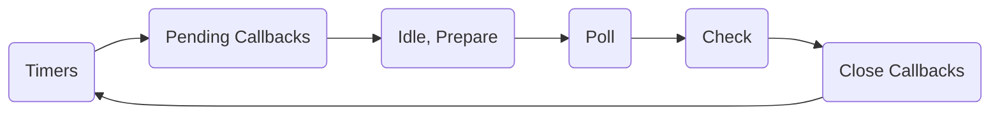

# Event Loop

The event loop is a core concept in Node.js and JavaScript environments that
enables asynchronous programming. It allows Node.js to perform non-blocking I/O
operations, even though JavaScript itself is single-threaded.

When Node.js starts, it initializes the event loop and begins executing the code
in the main module.

1. As asynchronous operations are encountered, such as file reads, network
   requests, or timers, these tasks are _delegated to the system kernel_.
2. Once the kernel completes a task, it signals Node.js to add the corresponding
   _callback_ to the appropriate phase of the event loop.

## Event Loop Phases

The event loop runs continuously, processing tasks in a loop. It consists of
several phases, each responsible for specific types of operations.

1. **Timers**
   - Executes callbacks scheduled by `setTimeout()` and `setInterval()`.
   - These callbacks are executed only after the specified delay has elapsed.

2. **Pending Callbacks**
   - Handles almost all callbacks except for close callbacks, timers, and
     setImmediate() callbacks.
   - Executes I/O operations like reading and writing to files.

3. **Idle, Prepare**
   - Internal use only.

4. **Poll**
   - Retrieves new I/O events.
   - Executes I/O-related callbacks immediately if there are any.
   - If no I/O events are pending, it will wait for callbacks to be added to the
     queue.

5. **Check**
   - Executes callbacks scheduled by `setImmediate()`.

6. **Close Callbacks**

   - Executes close callbacks, such as `socket.on('close', ...)`.
